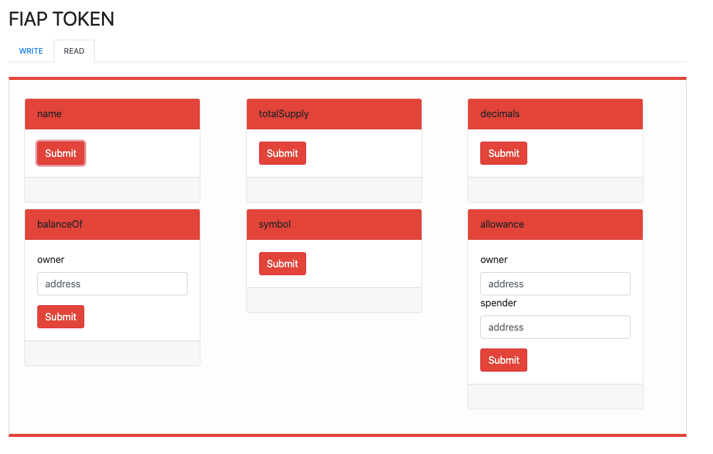

## Fiap-Token (1BLC)
Projeto desenvolvido como avaliação da disciplina Ethereum Dapps and API Integration

## Integrantes
```
 Fabio Vivas
 Renato Puga
 Rodrigo Masson
 Eduardo Salvatore
```

## Requerido

* MetaMask: [MetaMask Chrome](https://chrome.google.com/webstore/detail/metamask/alfaaahkadkbgeoannfbpbpkoacfacjc/related?gclid=EAIaIQobChMIg5mg16iQ6QIVhQeRCh3J2QXfEAAYASAAEgKtlvD_BwE)
* Selecione a **Ropsten Test Network**

## Demo on-line 

* http://13.90.32.90:3300/

## Instalação Local
Instruções para compilar e executar o frontend localmente

```bash
# clonar o repositorio
git clone  https://github.com/fabiovivas/fiap-token.git

# instalar
npm install

# subir o servidor
node server

# acessar pelo browser
http://localhost:3300/
```

## Screen shots

* Write


* Read

